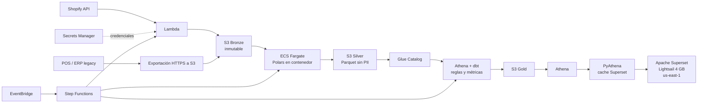

# Propuesta AWS: una vista única de ventas e inventario

## Resumen ejecutivo

CaféNorte tendrá **un solo número de ventas e inventario para todas las tiendas**, con reglas auditables desde POS, ERP y Shopify. La solución recomendada, incluido Apache Superset **sin costo por usuario** en Lightsail de 4 GB, opera completamente en `us-east-1` por **USD 34.49/mes** con dev/test y 15% de contingencia; quedan **USD 165.51 del presupuesto de USD 200** para sumar tiendas y absorber crecimiento 5×.

## Arquitectura y operación

**Ingesta.** Se asume que POS y ERP pueden generar exportaciones diarias CSV/JSON y subirlas mediante HTTPS con URL prefirmada; debe validarse con el proveedor. Es la opción razonable: AWS Transfer SFTP costaría USD 0.30/h (≈USD 216/mes) más datos. Shopify usa Lambda y Secrets Manager.

**Superset en AWS.** El despliegue inicia Superset, PostgreSQL de metadatos, Redis y proxy HTTPS, carga dashboards versionados y crea un administrador inicial desde un secreto externo; la contraseña se rota al primer acceso. PyAthena consulta únicamente Gold y la caché evita repetir consultas Athena. En producción se habilita OAuth Google/Microsoft y RLS: gerente = su tienda; dirección = todas. Solo se publica HTTPS/443 con Let's Encrypt; 22 permanece cerrado y la administración usa SSM Session Manager mediante SSM Agent/activación de nodo administrado.

**Región e identidad AWS.** Se recomienda desplegar **todo en `us-east-1`**, incluido Lightsail: evita tráfico entre regiones y ofrece precio fijo. Lightsail no admite instance profiles/roles IAM; Superset usa un usuario IAM de solo lectura limitado al workgroup Athena, Glue Catalog, Gold y bucket de resultados. Sus llaves viven fuera de la imagen y del repositorio en un archivo `600`, montado read-only y rotado cada 90 días. Si Jurídico exige residencia nacional, **todo** se despliega en `mx-central-1` y Superset usa EC2 `t4g.medium` con instance profile, sin llaves persistentes. No se usa NAT Gateway: Lambda queda fuera de VPC y las tareas batch usan IP temporal sin puertos entrantes más endpoint S3.

## Costo, alternativas y riesgos

Supuestos: 80 mil filas POS/mes, inventario diario de 40 tiendas, 1,000 pedidos Shopify/mes, una corrida diaria y 0.10 TB/mes escaneados. Importes USD sin IVA, soporte ni horas operativas; tarifas y fórmulas en [`COSTOS_DETALLE.md`](COSTOS_DETALLE.md).

| Bloque mensual | Mínimo | Esperado | Crecimiento 5× |
|---|---:|---:|---:|
| Ingesta + 2 secretos | 0.82 | 0.85 | 1.05 |
| Procesamiento/orquestación | 0.07 | 0.23 | 0.67 |
| S3, Athena, ECR y catálogo | 0.31 | 1.34 | 6.20 |
| Seguridad, logs y operación | 1.25 | 2.00 | 6.00 |
| Dev/test aislado | 0.25 | 0.57 | 2.50 |
| Superset Lightsail 4 GB + 20 GB de snapshots | 25.00 | 25.00 | 25.00 |
| **Subtotal** | **27.70** | **29.99** | **41.42** |
| Contingencia 15% | 4.16 | 4.50 | 6.21 |
| **Total mensual** | **31.86** | **34.49** | **47.63** |
| **Margen disponible vs. USD 200** | **168.14** | **165.51** | **152.37** |

La alternativa íntegramente mexicana sustituye Lightsail por EC2 y eleva el escenario esperado a **USD 48.53/mes** (subtotal USD 42.20 + contingencia USD 6.33), dejando **USD 151.47** de margen.

| Visor productivo | Costo mensual | Lectores | Lectura ejecutiva |
|---|---:|---:|---|
| **Superset Lightsail** | **USD 25** | Sin licencia por usuario | Recomendado: precio fijo y software abierto. |
| QuickSight: 1 autor + 5 lectores | USD 39 | 5 | Menos operación, costo por usuario. |
| QuickSight: 1 autor + 40 lectores | USD 144 | 40 | Crece linealmente por lector. |
| EC2 México `t4g.medium` + 80 GB gp3 + IPv4 + 20 GB snapshot | USD 37.20 | Sin licencia | Alternativa si Jurídico exige residencia nacional. |

Lightsail es una **instancia única sin alta disponibilidad**. TI o Tuxpas debe aplicar parches, vigilar capacidad, respaldar/restaurar metadatos y probar recuperación; snapshots no sustituyen el respaldo lógico de PostgreSQL a S3. Si CaféNorte no quiere esa operación, QuickSight es la ruta de salida administrada. Escalar Lightsail a 8 GB o separar metadatos si CPU/memoria supera 70% sostenido, p95 >10 s o las pruebas con 40 usuarios fallan.

## Fases y decisiones

| Fase | Entregable | Duración | Riesgo principal |
|---|---|---:|---|
| 1 | Contratos, seguridad e ingesta Bronze | 1 semana | Exportación real del legacy. |
| 2 | Polars, Silver, cuarentena y dev/test | 2 semanas | PII y formatos. |
| 3 | dbt, Gold y reconciliación | 2 semanas | Margen/devoluciones. |
| 4 | Superset Docker, OAuth/RLS, dashboards, backup y FinOps | 1 semana | Operación de instancia única. |

Antes de firmar: ¿CaféNorte confirma que `tiendas_info` del ERP es el maestro pese a que incluye
ciudades no mencionadas y clasifica Monterrey/Chihuahua como `centro`?; ¿está autorizado procesar
PII?; ¿POS/ERP pueden exportar y subir a S3?; ¿Google o Microsoft será el IdP?; ¿quién operará
parches y backups?
